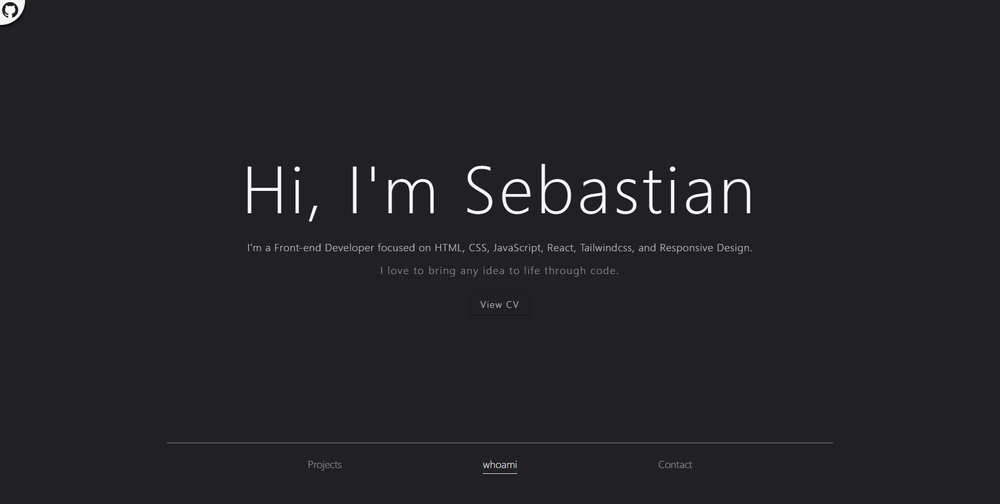
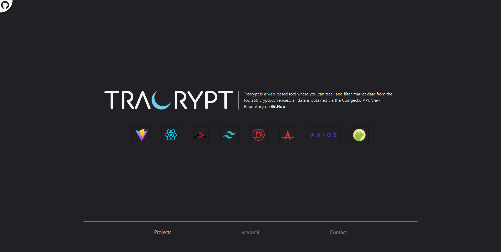
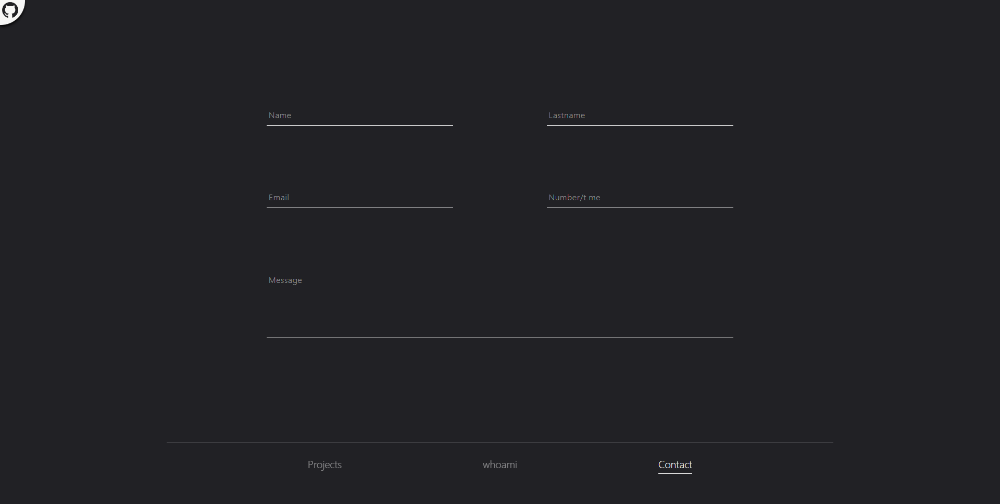
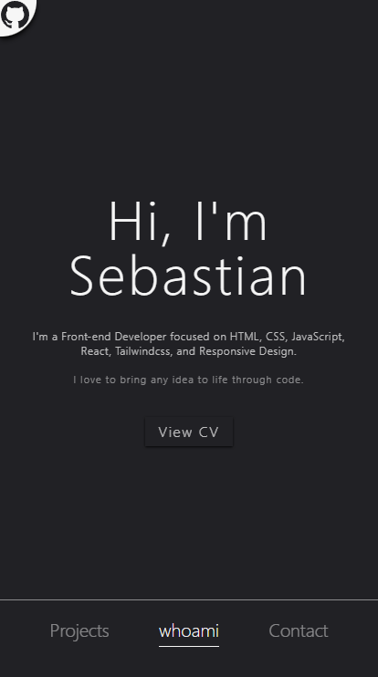
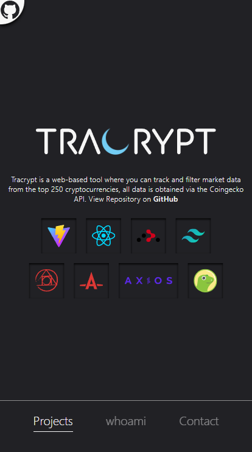
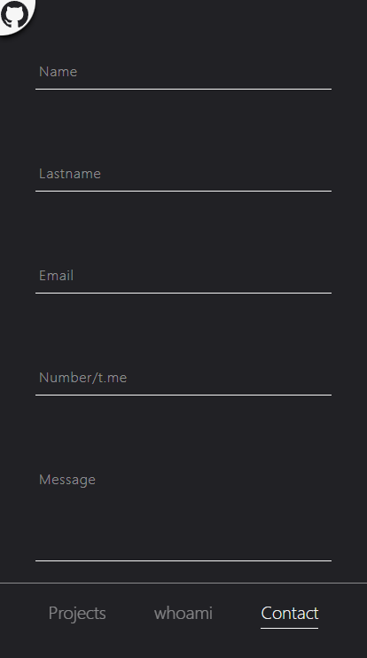

<p align="center">
  <a href="https://sebastianlacoste.com" target="_blank" rel="noopener noreferrer">
    
  </a>
</p>
<hr/>

> [Sebastian Lacoste](https://sebastianlacoste.com) is my Portfolio, where you can see my Projects, CV and Contact me.

## Features

- **Projects Showcase**

  - [Tracrypt](https://github.com/sebastianlacoste/tracrypt)

- **Contact Form**

- **PWA Support**

- **Mobile-Friendly**

## Tech Stack

- **Front-end**

  - **Build**

    - [Vite](https://github.com/vitejs/vite)

  - **HTML/JS**

    - [React](https://github.com/facebook/react)

    - [React Router](https://github.com/remix-run/react-router)

  - **CSS**

    - [Tailwindcss](https://github.com/tailwindlabs/tailwindcss)

    - [Postcss](https://github.com/postcss/postcss)

    - [Autoprefixer](https://github.com/postcss/autoprefixer)

  - **Email**

    - [EmailJS](https://github.com/emailjs-com/emailjs-sdk)

  - **reCAPTCHA**

    - [React Google reCAPTCHA](https://github.com/dozoisch/react-google-recaptcha)

## Run Locally

Clone the project

- HTTPS

  ```bash
  git clone https://github.com/sebastianlacoste/portfolio.git
  ```

- SSH

  ```bash
  git clone git@github.com:sebastianlacoste/portfolio.git
  ```

Go to the project directory

```bash
  cd portfolio
```

Install dev/Dependencies

```bash
  npm i
```

Start the server

```bash
  npm run dev
```

In the browser, go to

```
  http://localhost:3000
```

**All in One**

- HTTPS

  ```bash
  git clone https://github.com/sebastianlacoste/portfolio.git; cd portfolio; npm i; npm run dev;
  ```

- SSH

  ```bash
  git clone git@github.com:sebastianlacoste/portfolio.git; cd portfolio; npm i; npm run dev;
  ```

## Screenshots

- **Desktop**

   

   
  
   

- **Mobile**

  

  

  

## License

- [MIT](./LICENSE)