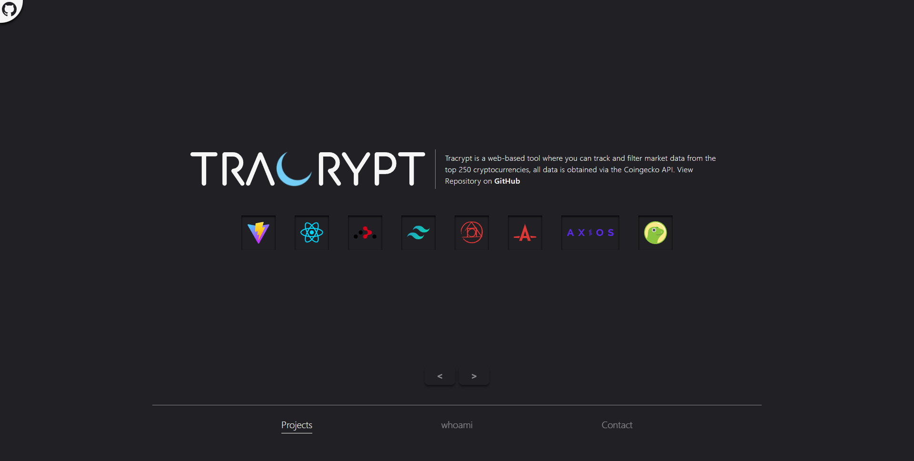
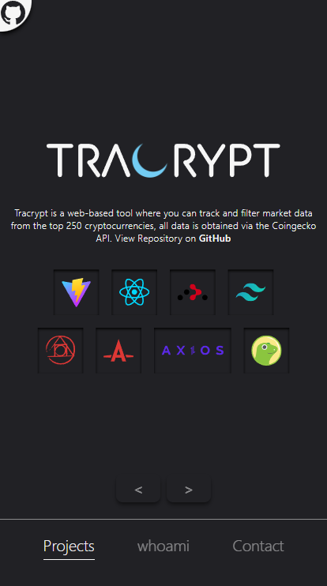

<p align="center">
  <a href="https://sebastianlacoste.com" target="_blank" rel="noopener noreferrer">
    
  </a>
</p>
<hr/>

> [Sebastian Lacoste](https://sebastianlacoste.com) is my Portfolio, where you can see my Projects, CV and Contact me.

## Features

- **Projects Showcase**

  - [Tracrypt](https://github.com/sebastianlacoste/tracrypt)

  - [Basis Front-end](https://github.com/sebastianlacoste/basis-frontend)

- **Contact Form**

- **PWA Support**

- **Mobile-Friendly**

## Tech Stack

- **Front-end**

  - **Build**

    - [Vite](https://github.com/vitejs/vite)

  - **HTML/JS**

    - [React](https://github.com/facebook/react)

    - [React Router](https://github.com/remix-run/react-router)

  - **CSS**

    - [Tailwind CSS](https://github.com/tailwindlabs/tailwindcss)

    - [Prettier plugin for Tailwind CSS](https://github.com/tailwindlabs/prettier-plugin-tailwindcss)

    - [PostCSS](https://github.com/postcss/postcss)

    - [Autoprefixer](https://github.com/postcss/autoprefixer)

  - **Email**

    - [EmailJS](https://github.com/emailjs-com/emailjs-sdk)

  - **reCAPTCHA**

    - [React Google reCAPTCHA](https://github.com/dozoisch/react-google-recaptcha)

## Environment Variables

Before running it locally, you must obtain the following values to initialize the required variables.

| Variable                         | Value                                                                                    | Description                                                                          |
| :------------------------------- | :--------------------------------------------------------------------------------------- | :----------------------------------------------------------------------------------- |
| `VITE_EMAILJS_PUBLIC_KEY`        | [Public Key](https://www.emailjs.com/docs/sdk/installation/)                             | **Required**. Public API Key                                                         |
| `VITE_EMAILJS_SERVICE_ID`        | [Service ID](https://www.emailjs.com/docs/user-guide/connecting-email-services/)         | **Required**. Email Service ID                                                       |
| `VITE_EMAILJS_TEMPLATE_ID`       | [Template ID](https://www.emailjs.com/docs/user-guide/creating-email-templates/)         | **Required**. Email Template ID                                                      |
| `VITE_GOOGLE_RECAPTCHA_SITE_KEY` | [Site/Private Key](https://www.emailjs.com/docs/user-guide/adding-captcha-verification/) | **Required**. Site Key for React Google reCAPTCHA and Private Key for Email Template |

## Run Locally

Install required

- [Node.js/npm](https://nodejs.org/en/download)

Clone the repository

- HTTPS

  ```bash
  git clone https://github.com/sebastianlacoste/portfolio.git
  ```

- SSH

  ```bash
  git clone git@github.com:sebastianlacoste/portfolio.git
  ```

Go to the repository directory

```bash
  cd portfolio/
```

Install dev/Dependencies

```bash
  npm i
```

Add Environment Variables to `.env` file

- You must replace **"somevalue"** with your own values.

```bash
  echo $'VITE_EMAILJS_PUBLIC_KEY=somevalue\nVITE_EMAILJS_SERVICE_ID=somevalue\nVITE_EMAILJS_TEMPLATE_ID=somevalue\n\nVITE_GOOGLE_RECAPTCHA_SITE_KEY=somevalue' >> .env
```

Start the server

```bash
  npm run dev
```

In the browser, go to

```
  http://localhost:3000
```

**All-In-One**

- HTTPS

  ```bash
  git clone https://github.com/sebastianlacoste/portfolio.git; cd portfolio/; npm i; echo $'VITE_EMAILJS_PUBLIC_KEY=somevalue\nVITE_EMAILJS_SERVICE_ID=somevalue\nVITE_EMAILJS_TEMPLATE_ID=somevalue\n\nVITE_GOOGLE_RECAPTCHA_SITE_KEY=somevalue' >> .env; npm run dev;
  ```

- SSH

  ```bash
  git clone git@github.com:sebastianlacoste/portfolio.git; cd portfolio/; npm i; echo $'VITE_EMAILJS_PUBLIC_KEY=somevalue\nVITE_EMAILJS_SERVICE_ID=somevalue\nVITE_EMAILJS_TEMPLATE_ID=somevalue\n\nVITE_GOOGLE_RECAPTCHA_SITE_KEY=somevalue' >> .env; npm run dev;
  ```

## Screenshots

- **Desktop**

  

  

  

- **Mobile**

  

  

  

## License

- [MIT](./LICENSE)
